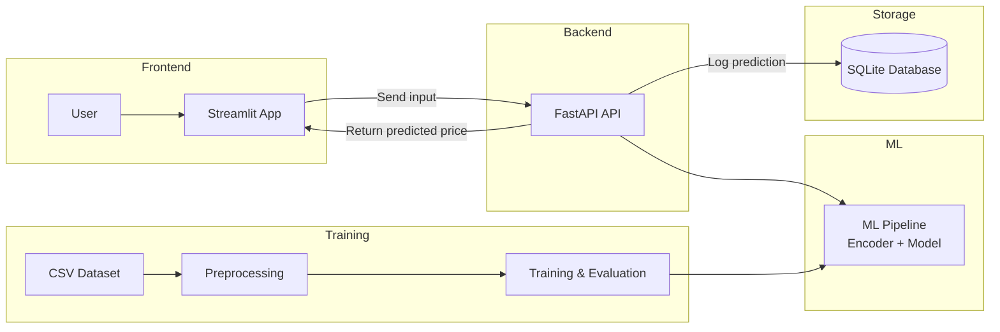
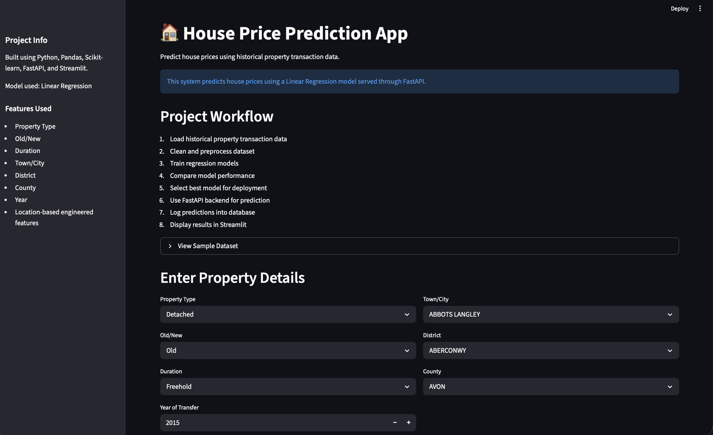
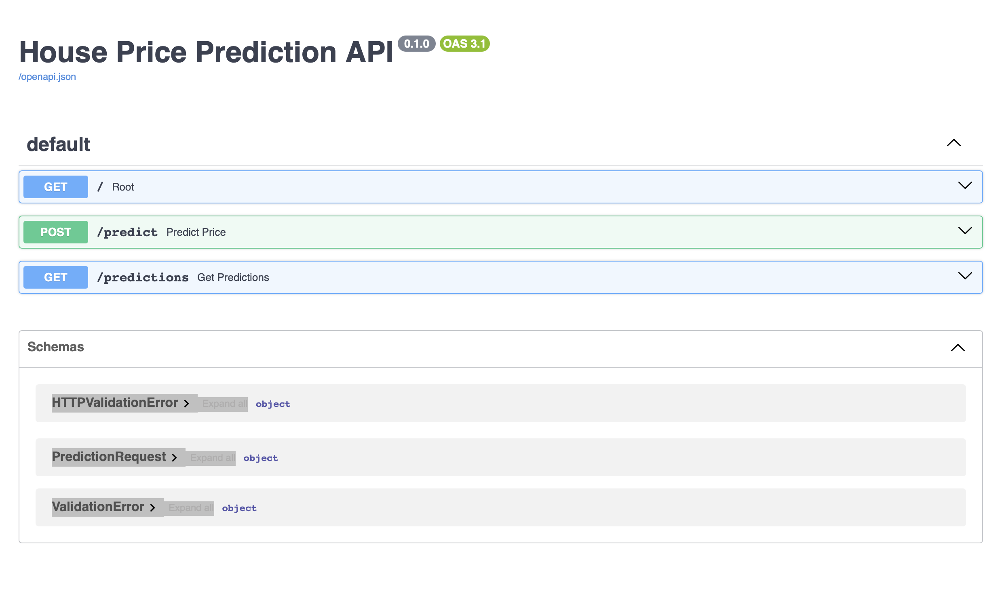

# **🏠 House Price Prediction System**

  

Machine Learning & Full-Stack Deployment Project


Author: **Aditya Singh**

----------

# **📌 Project Overview**

  

This project is a  **full-stack machine learning system**  designed to predict house prices using historical property transaction data.

  

The system integrates:

-   Machine Learning model training
    
-   Backend API for predictions
    
-   Interactive web dashboard
    
-   Database logging of predictions
    
-   Containerized deployment using Docker
    

  

The project demonstrates an **end-to-end ML workflow from data preprocessing to deployment.**

----------

# **✨ Features**

  

✔ Data preprocessing pipeline

✔ Categorical feature encoding

✔ Multiple regression models trained

✔ Model performance comparison

✔ Linear Regression model used for deployment

✔ REST API built with FastAPI

✔ Interactive dashboard using Streamlit

✔ Prediction logging to SQLite database

✔ Docker containerization for reproducible deployment

✔ Location-based price analysis dashboard  

✔ Model feature importance visualization  

✔ MLflow experiment tracking for model training

----------

# **⚙️ Tech Stack**

  

## **Programming Language**

-   Python
    

  

## **Machine Learning**

-   Scikit-learn
    
-   Pandas
    
-   NumPy
    

  

## **Backend API**

-   FastAPI
    
-   Uvicorn
    

  

## **Frontend Dashboard**

-   Streamlit
    

  

## **Database**

-   SQLite
    

  

## **Deployment**

-   Docker
    
-   Docker Compose
    

----------

# **🧠 Machine Learning Pipeline**

  

The machine learning workflow followed in this project:

1.  Load historical property transaction dataset
    
2.  Clean and preprocess dataset
    
3.  Encode categorical variables
    
4.  Train regression models
    
5.  Evaluate model performance
    
6.  Select model for deployment
    
7.  Deploy prediction API using FastAPI
    
8.  Build interactive UI using Streamlit
    
9.  Log predictions to SQLite database
    
10.  Containerize the system using Docker
    

----------

# **📊 Dataset**

  

Dataset used:

  

👉 https://www.kaggle.com/datasets/hm-land-registry/uk-housing-prices-paid

  

The dataset contains historical UK property transaction records including:

-   property type
    
-   location (town/city, district, county)
    
-   property condition (new/old)
    
-   ownership duration
    
-   transaction date
    
-   sale price
    

  

The dataset is published by the  **UK Land Registry**  and contains large-scale real estate transaction data.

----------

## 📍 Location Insights

The Streamlit dashboard includes location-based analytics that allow users to explore regional housing trends.

The dashboard displays:

- Top 10 most expensive towns and cities
- Top 10 most affordable towns and cities
- Average house prices by county
- Average house prices by district
- Detailed county-level analysis

These insights help users understand regional price variations in the housing market.

---

## **📊 Model Performance**

Several regression models were trained and evaluated using MAE, MSE, RMSE, R² Score, and cross-validation.

## 📊 Model Performance Comparison

| Model | MAE | MSE | RMSE | R2 Score | CV Mean R2 |
|------|------|------|------|------|------|
| Linear Regression | 84793.5665 | 35531128923 | 188497.0263 | 0.2360559754 | 0.1205277606 |
| Decision Tree | 66668.81589 | 78385657903 | 279974.3879 | -0.6853462522 | -0.04580773359 |
| Gradient Boosting | 69202.06955 | 84768597990 | 291150.4731 | -0.8225839107 | -0.1003212652 |
| Random Forest Tuned | 64146.22748 | 57402220388 | 239587.6048 | -0.2341877275 | 0.07344626178 |

**Linear Regression achieved the best overall performance and was selected as the final deployed model.**

  

Although tree-based models produced lower MAE in some cases, their negative R² scores indicate weaker overall fit and poor generalization on this dataset.

  

The dataset mainly contains transaction metadata such as:

-   property type
    
-   ownership duration
    
-   location (town, district, county)
    
-   transaction year
    

  

but lacks important property attributes like:

-   bedrooms
    
-   floor area
    
-   bathrooms
    
-   property condition
    

  

Because of this, simpler linear relationships performed better than more complex non-linear models.

----------

## 🔎 Model Interpretability

The dashboard includes a **feature importance visualization** that highlights which variables influence house price predictions.

For tree-based models (Decision Tree, Random Forest, Gradient Boosting), feature importance values are extracted during training and displayed in the Streamlit dashboard.

This improves transparency and helps understand how the model makes predictions.

---

## **⚙️ Model Optimization**

  

Hyperparameter tuning was performed using  **RandomizedSearchCV**  for the Random Forest model.

  

This automated search evaluated multiple parameter combinations including:

-   number of trees
    
-   maximum depth
    
-   minimum samples per split
    
-   minimum samples per leaf
    

  

Although tuning improved model stability, Linear Regression still produced the highest R² score and was therefore selected for deployment.

----------

## 🧪 Experiment Tracking

Model training experiments are tracked using **MLflow**.

MLflow automatically records:

- model parameters
- evaluation metrics
- cross-validation results
- trained model artifacts

Each training run is logged as an experiment, allowing easy comparison between models such as:

- Linear Regression
- Decision Tree
- Gradient Boosting
- Random Forest

MLflow improves reproducibility and experiment management during model development.

---

# **🏗 System Architecture**



----------

# **📂 Project Structure**

```
house-price-prediction/
├── Dockerfile
├── LICENSE
├── README.md
├── Screenshots
│   ├── fastapi_docs.png
│   └── streamlit_ui.png
├── api
│   ├── main.py
│   └── schemas.py
├── app
│   └── streamlit_app.py
├── data
│   ├── dataset_sample.md
│   ├── extract_metadata.ipynb
│   └── price_paid_records.csv
├── database
│   └── db.py
├── docker-compose.yml
├── house_predictions.db
├── models
│   ├── county_encoder.pkl
│   ├── district_encoder.pkl
│   ├── duration_encoder.pkl
│   ├── house_price_model.pkl
│   ├── house_price_pipeline.pkl
│   ├── model_metrics.csv
│   ├── old_new_encoder.pkl
│   ├── property_type_encoder.pkl
│   └── town_city_encoder.pkl
├── notebooks
│   └── house_price_prediction.ipynb
├── requirements.txt
├── mlruns/  
├── mlflow.db
└── src
    ├── data_preprocessing.py
    ├── predict.py
    └── train_model.py
```

----------

# **📸 Application Preview**

  

## **Streamlit Interface**


## **FastAPI Swagger Documentation**


----------

# **🚀 Running the Project Locally**

  

## **1️⃣ Clone repository**

```
git clone https://github.com/AdItyAsIngh1800/house-price-prediction.git
cd house-price-prediction
```

2️⃣ Install dependencies

```
pip install -r requirements.txt
```

----------
### Run MLflow UI

After training models, you can inspect experiment results using MLflow.

Start the MLflow tracking server:

```bash
mlflow server --backend-store-uri sqlite:///mlflow.db --default-artifact-root ./mlruns --port 5000
```
Open the MLflow dashboard:
http://localhost:5000

---
3️⃣ Start FastAPI server

```
uvicorn api.main:app --reload
```

FastAPI documentation available at:

```
http://localhost:8000/docs
```

----------

4️⃣ Run Streamlit app

```
streamlit run app/streamlit_app.py
```

Streamlit runs at:

```
http://localhost:8501
```

----------

🐳 Running with Docker

  

Build containers:

```
docker compose build
```

Start containers:

```
docker compose up
```

This will start:

  

• FastAPI service

• Streamlit dashboard

• SQLite database logging

----------

🔌 API Endpoint

  

POST /predict

  

Predict house price.

  

Example request:

```
curl -X POST "http://localhost:8000/predict" \
-H "Content-Type: application/json" \
-d '{
"property_type": "D",
"old_new": "Y",
"duration": "F",
"town_city": "LONDON",
"district": "CAMDEN",
"county": "GREATER LONDON",
"year": 2015
}'
```

Example response:

```
{
"predicted_price": 452000
}
```

----------

🗄 Prediction Logging

  

Each prediction is stored in a SQLite database including:

  

• property type

• location details

• transaction year

• predicted price

• timestamp

  

This enables tracking of prediction history and usage patterns.

----------

⚠ Limitations

  

The dataset does not include several important real estate features such as:

  

• number of bedrooms

• property area

• number of bathrooms

• building condition

  

Therefore predictions are based mainly on:

  

• property type

• ownership duration

• location

• transaction year

----------

🚀 Future Improvements

  

Possible improvements include:

  

• Adding additional property features

• Implementing advanced models (XGBoost, LightGBM)

• Adding geospatial location features

• Deploying the system on cloud platforms (AWS / GCP / Azure)

• Adding authentication and analytics dashboard

----------

💼 CV Project Description

Built and deployed a full-stack machine learning system to predict property prices using historical UK Land Registry data. Implemented data preprocessing, feature engineering, and regression model comparison with Scikit-learn. Deployed the model through a FastAPI REST API with a Streamlit interactive dashboard, integrated SQLite database logging, and containerized the application using Docker.

----------

📜 License

  

This project is licensed under the MIT License.

----------
